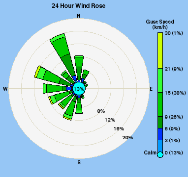

# Windrose Image Generator for weewx

## Description
The Stacked Windrose Image Generator for weewx is a `weewx` extension that generates a polar windrose plot image file based upon `weewx` archive data. The image file is suitable for publishing on a web page, inclusing in a `weewx` template or for use elsewhere.

The extension consists of a single `weewx` skin that controls a custom image generator. Various image parameters including the plot period, source data field, units of measure and colours can be controlled through settings in `weewx.conf`.

Below is an example polar windrose plot generated by the Stacked Windrose Image Generator for weewx.

## Pre-Requisites

Weewx v3.2.0 or greater.

## File Locations

As `weewx` file locations vary by system and installation method, the following symbolic names, as per the User's Guide to the weewx Weather System - [Installing Weewx](http://weewx.com/docs/usersguide.htm#installing), are used in these instructions: 

- $BIN_ROOT (executables)  
- $SKIN_ROOT (skins and templates)  
- $HTML_ROOT (web pages and images)  

Where applicable the nominal location for your system and installation type should be used in place of the symbolic name

## Installation Instructions

1.	Download the Stacked Windrose Image Generator for weewx extension package from the [Releases](https://github.com/gjr80/weewx-stackedwindrose/releases "weewx-stackedwindrose Releases page on GitHub") page. The current release package is named `stackedwindrose-2.0.2.tar.gz`. If your `weewx` PC has internet access you may be able to download the package directly as follows:

		$ wget -P /var/tmp/ https://github.com/gjr80/weewx-stackedwindrose/releases/download/v2.0.2/stackedwindrose-2.0.2.tar.gz

1.	Run the installer:

    	$ ./wee_extension --install=/var/tmp/stackedwindrose-2.0.2.tar.gz
    
    This command assumes the user is currently in the $BIN_ROOT folder.

1.	Various attributes of the generated plot can be controlled through a number of settings in the `[StdReport]` `[[StackedWindRose]]` section in `weewx.conf`. This approach has the advantage of retaining user settings across upgrades of this extension but any change to these paramaters will require a `weewx` configuration reload or a `weewx` stop/start. The extension installer does not permit comments to be included in `weewx.conf` so the windrose plot parameters and explanatory notes are included below. Commonly changed options include the units of measure (`group_speed` parameter) and date-time format (`time_stamp` parameter). Edit any parameters as required:

	    [[StackedWindRose]]
	        skin = StackedWindRose
	
	        [[[Units]]]
	
	            [[[[Groups]]]]
	                # group_speed sets the display units for the windrose plots
	                group_speed = km_per_hour   # Options are 'mile_per_hour',
	                                            # 'km_per_hour', 'knot', or
	                                            # 'meter_per_second'
	
	            [[[[Labels]]]]
	                # This section sets a label to be used for each type of unit.
	
	                km_per_hour       = "km/h"
	                knot              = "knots"
	                meter_per_second  = "m/s"
	                mile_per_hour     = "mph"
	
	        [[[Labels]]]
	            # Set to compass point abbreviations suitable for your location.
	            # Must be in the order of North, South, East, West.
	            compass_points = N, S, E, W
	
	            [[[[Generic]]]]
	                # This section sets the labels to be used when displaying
	                # either windGust or windSpeed
	                windGust  = Gust Speed
	                windSpeed = Wind Speed
	
	        [[[ImageStackedWindRoseGenerator]]]
	            # This section contains the options for the Stacked Wind Rose image
	            # generator. A number of plotting options can be set such as
	            # colour, fonts, sizes etc. Some options have default values if
	            # the option or value is omitted, these defaults are specified
	            # where applicable.
	            #
	            # Fonts can be anything accepted by the Python Imaging Library
	            # (PIL), which is currently truetype (.ttf), or PIL's own font
	            # format (.pil). See
	            # http://www.pythonware.com/library/pil/handbook/imagefont.htm for
	            # more details.  Note that "font size" is only used with truetype
	            # (.ttf) fonts. For others, font size is determined by the
	            # bit-mapped size, usually encoded in the file name (eg courB010.pil).
	            #
	            # Colors can be specified any of three ways:
	            #   1. Notation 0xBBGGRR;
	            #   2. Notation #RRGGBB; or
	            #   3. Using an English name, such as 'yellow', or 'blue'.
	            # So, 0xff0000, #0000ff, or 'blue' would all specify a pure blue
	            # colour.
	
	            # Image file to be used to used as the background for the plot. If
	            # it does not exist or is set to none/None the background will be
	            # image_height x image_width pixels with colour set to
	            # image_background_box_color. eg
	            #   image_background_image = windrose_bground.png
	            # woudld use the file windrose_bground.png as the background image.
	            image_background_image = none
	
	            # Overall width and height of image
	            image_width = 382
	            image_height = 361
	            # Fill colour of plot circles
	            image_background_circle_color = 0xF5F5F5
	            # Colour of background box
	            image_background_box_color = 0xF5C696
	            # Colour of range rings on plot
	            image_background_range_ring_color = 0xC3D9DD
	
	            # Minimum distance (in pixels) from edge of image to plot/legend
	            windrose_plot_border = 5
	            # Width of legend stacked bar (in pixels)
	            windrose_legend_bar_width = 10
	
	            # Font to be used
	            windrose_font_path = /usr/share/fonts/truetype/freefont/FreeSansBold.ttf
	            # Font setting for N,E,S,W, bullseye % and % rings
	            windrose_plot_font_size  = 10
	            windrose_plot_font_color = 0x000000
	            # Font setting for plot legend
	            windrose_legend_font_size = 10
	            windrose_legend_font_color = 0x000000
	            # Font setting for plot label/title
	            windrose_label_font_size = 12
	            windrose_label_font_color = 0x000000
	
	            # Comma separated list of colours used for stacked 'petals' on
	            # windrose.
	            # First colour is for Calm/0 speed, 2nd for 1st band, 2nd for
	            # 3rd band etc. Defaults to 'lightblue', 'blue', 'midnightblue',
	            # 'forestgreen', 'limegreen', 'green', 'greenyellow'
	            # Only 7 colours will be used irrespective of how many are listed.
	            windrose_plot_petal_colors = aqua, 0xFF9900, 0xFF3300, 0x009900, 0x00CC00, 0x33FF33, 0x00FFCC
	            # Width of petals in degrees. If not set default is 16 degrees
	            windrose_plot_petal_width = 16
	
	            [[[[day_images]]]]
	                # Period (in seconds) over which wind rose is constructed.
	                # 86400 will use wind samples from past 24 hours, 43200 uses
	                # 12 hours of samples etc
	                time_length = 86400 # == 24 hours
	
	                [[[[[daywindrose]]]]]
	                    # Image filename will be [[[]]] setting on line above with
	                    # extension as per format setting below. [[[daywindrose]]]
	                    # using png format will result in file being named
	                    # daywindrose.png
	
	                    # File format of resulting image file. Use any file
	                    # extension for image formats that PIL can write
	                    # (eg png, gif etc). Defaults to png if omitted.
	                    format = png
	
	                    # To use windGust data for wind rose set [[[[windGust]]]]
	                    # on next line, to use windSpeed set next line to
	                    # [[[[windSpeed]]]]
	                    
						[[[[[[windGust]]]]]]
	                        # Label/title for  plot
	                        label = 24 Hour Wind Rose
	
	                        # Format of optional time stamp to be placed on image.
	                        # Format directived as per Python datetime format
	                        # directives at
	                        # https://docs.python.org/2/library/datetime.html
	
	                        time_stamp = %H:%M %d %b %y
	
	                        # Location of optional time stamp on image. If omitted
	                        # no time stamp is included. Format for setting is
	                        # vertical_position, horizontal_position where
	                        # vertical_position is one of top or bottom;
	                        # horizontal_position is one of left, center, right.
	                        # Default setting (if option is present) is
	                        # bottom, right
	
	                        time_stamp_location = bottom, right

1.	By default the Stacked Windrose Image Generator for weewx generator places the generated file in the `$HTML_ROOT` folder. If you wish to place the generated files in another directory then insert a `HTML_ROOT` setting giving the applicable folder under the `[[StackedWindRose]]` sub-section in the `[StdReport]` section of `weewx.conf`, eg:

	    [[StackedWindRose]]
	        skin = StackedWindRose
	        HTML_ROOT = /use/this/folder

1.	Restart `weewx`:

    	$ sudo /etc/init.d/weewx stop
	    $ sudo /etc/init.d/weewx start

1.	This will result in the windrose image file being generated during each report generation cycle. Generation can be confirmed by inspecting the `weewx` log, there should be a line similar to this amongst the report generation output: 

		Aug  9 00:30:16 jessie2 weewx[1236]: imageStackedWindRose: Generated 1 images for StackedWindRose in 0.01 seconds

## Manual Installation Instructions

1.	Download the Stacked Windrose Image Generator for weewx extension package from the [Releases](https://github.com/gjr80/weewx-stackedwindrose/releases "weewx-stackedwindrose Releases page on GitHub") page. The current release oackage is named `stackedwindrose-2.0.2.tar.gz`. If your `weewx` PC has internet access you may be able to download the package directly as follows:

		$ wget -P /var/tmp/ https://github.com/gjr80/weewx-stackedwindrose/releases/download/v2.0.2/stackedwindrose-2.0.2.tar.gz

1.	Extract the files from the tar.gz file:

   		$ tar -zxvf /var/tmp/stackedwindrose-2.0.2.tar.gz -C /var/tmp

	**Note**: This will extract the extension package files to the `/var/tmp` folder

1.	Copy files as follows:

	$ cp /var/tmp/stackedwindrose/bin/user/imageStackedWindRose.py $BIN_ROOT/user
    	$ cp -R /var/tmp/stackedwindrose/skins/* $SKIN_ROOT

1.	In `weewx.conf`, modify the `[StdReport]` section by adding the following sub-section:

	    [[StackedWindRose]]
	        skin = StackedWindRose

1.	Various attributes of the generated plot can be controlled through a number of settings in the `[StdReport]` `[[StackedWindRose]]` section in `weewx.conf`. This approach has the advantage of retaining user settings across upgrades of this extension but any change to these paramaters will require a `weewx` configuration reload or a `weewx` stop/start. The extension installer does not permit comments to be included in `weewx.conf` so the windrose plot parameters and explanatory notes are included below. Commonly changed options include the units of measure (`group_speed` parameter) and date-time format (`time_stamp` parameter). Edit any parameters as required:

	    [[StackedWindRose]]
	        skin = StackedWindRose
	
	        [[[Units]]]
	
	            [[[[Groups]]]]
	                # group_speed sets the display units for the windrose plots
	                group_speed = km_per_hour   # Options are 'mile_per_hour',
	                                            # 'km_per_hour', 'knot', or
	                                            # 'meter_per_second'
	
	            [[[[Labels]]]]
	                # This section sets a label to be used for each type of unit.
	
	                km_per_hour       = "km/h"
	                knot              = "knots"
	                meter_per_second  = "m/s"
	                mile_per_hour     = "mph"
	
	        [[[Labels]]]
	            # Set to compass point abbreviations suitable for your location.
	            # Must be in the order of North, South, East, West.
	            compass_points = N, S, E, W
	
	            [[[[Generic]]]]
	                # This section sets the labels to be used when displaying
	                # either windGust or windSpeed
	                windGust  = Gust Speed
	                windSpeed = Wind Speed
	
	        [[[ImageStackedWindRoseGenerator]]]
	            # This section contains the options for the Stacked Wind Rose image
	            # generator. A number of plotting options can be set such as
	            # colour, fonts, sizes etc. Some options have default values if
	            # the option or value is omitted, these defaults are specified
	            # where applicable.
	            #
	            # Fonts can be anything accepted by the Python Imaging Library
	            # (PIL), which is currently truetype (.ttf), or PIL's own font
	            # format (.pil). See
	            # http://www.pythonware.com/library/pil/handbook/imagefont.htm for
	            # more details.  Note that "font size" is only used with truetype
	            # (.ttf) fonts. For others, font size is determined by the
	            # bit-mapped size, usually encoded in the file name (eg courB010.pil).
	            #
	            # Colors can be specified any of three ways:
	            #   1. Notation 0xBBGGRR;
	            #   2. Notation #RRGGBB; or
	            #   3. Using an English name, such as 'yellow', or 'blue'.
	            # So, 0xff0000, #0000ff, or 'blue' would all specify a pure blue
	            # colour.
	
	            # Image file to be used to used as the background for the plot. If
	            # it does not exist or is set to none/None the background will be
	            # image_height x image_width pixels with colour set to
	            # image_background_box_color. eg
	            #   image_background_image = windrose_bground.png
	            # woudld use the file windrose_bground.png as the background image.
	            image_background_image = none
	
	            # Overall width and height of image
	            image_width = 382
	            image_height = 361
	            # Fill colour of plot circles
	            image_background_circle_color = 0xF5F5F5
	            # Colour of background box
	            image_background_box_color = 0xF5C696
	            # Colour of range rings on plot
	            image_background_range_ring_color = 0xC3D9DD
	
	            # Minimum distance (in pixels) from edge of image to plot/legend
	            windrose_plot_border = 5
	            # Width of legend stacked bar (in pixels)
	            windrose_legend_bar_width = 10
	
	            # Font to be used
	            windrose_font_path = /usr/share/fonts/truetype/freefont/FreeSansBold.ttf
	            # Font setting for N,E,S,W, bullseye % and % rings
	            windrose_plot_font_size  = 10
	            windrose_plot_font_color = 0x000000
	            # Font setting for plot legend
	            windrose_legend_font_size = 10
	            windrose_legend_font_color = 0x000000
	            # Font setting for plot label/title
	            windrose_label_font_size = 12
	            windrose_label_font_color = 0x000000
	
	            # Comma separated list of colours used for stacked 'petals' on
	            # windrose.
	            # First colour is for Calm/0 speed, 2nd for 1st band, 2nd for
	            # 3rd band etc. Defaults to 'lightblue', 'blue', 'midnightblue',
	            # 'forestgreen', 'limegreen', 'green', 'greenyellow'
	            # Only 7 colours will be used irrespective of how many are listed.
	            windrose_plot_petal_colors = aqua, 0xFF9900, 0xFF3300, 0x009900, 0x00CC00, 0x33FF33, 0x00FFCC
	            # Width of petals in degrees. If not set default is 16 degrees
	            windrose_plot_petal_width = 16
	
	            [[[[day_images]]]]
	                # Period (in seconds) over which wind rose is constructed.
	                # 86400 will use wind samples from past 24 hours, 43200 uses
	                # 12 hours of samples etc
	                time_length = 86400 # == 24 hours
	
	                [[[[[daywindrose]]]]]
	                    # Image filename will be [[[]]] setting on line above with
	                    # extension as per format setting below. [[[daywindrose]]]
	                    # using png format will result in file being named
	                    # daywindrose.png
	
	                    # File format of resulting image file. Use any file
	                    # extension for image formats that PIL can write
	                    # (eg png, gif etc). Defaults to png if omitted.
	                    format = png
	
	                    # To use windGust data for wind rose set [[[[windGust]]]]
	                    # on next line, to use windSpeed set next line to
	                    # [[[[windSpeed]]]]
	                    
						[[[[[[windGust]]]]]]
	                        # Label/title for  plot
	                        label = 24 Hour Wind Rose
	
	                        # Format of optional time stamp to be placed on image.
	                        # Format directived as per Python datetime format
	                        # directives at
	                        # https://docs.python.org/2/library/datetime.html
	
	                        time_stamp = %H:%M %d %b %y
	
	                        # Location of optional time stamp on image. If omitted
	                        # no time stamp is included. Format for setting is
	                        # vertical_position, horizontal_position where
	                        # vertical_position is one of top or bottom;
	                        # horizontal_position is one of left, center, right.
	                        # Default setting (if option is present) is
	                        # bottom, right
	
	                        time_stamp_location = bottom, right

1.	By default the Stacked Windrose Image Generator for weewx generator places the generated file in the `$HTML_ROOT` folder. If you wish to place the generated files in another directory then insert a `HTML_ROOT` setting giving the applicable folder under the `[[StackedWindRose]]` sub-section in the `[StdReport]` section of `weewx.conf`, eg:

	    [[StackedWindRose]]
	        skin = StackedWindRose
	        HTML_ROOT = /use/this/folder

1.	Restart `weewx`:

    	$ sudo /etc/init.d/weewx stop
        $ sudo /etc/init.d/weewx start

1.	This will result in the windrose image file being generated during each report generation cycle. Generation can be confirmed by inspecting the `weewx` log, there should be a line similar to this amongst the report generation output: 

		Aug  9 00:30:16 jessie2 weewx[1236]: imageStackedWindRose: Generated 1 images for StackedWindRose in 0.01 seconds

## Uninstallation Instructions

1.  Run the uninstaller:

    	$ ./wee_extension --uninstall=StackedWindRose

    This command assumes the user is currently in the $BIN_ROOT folder.

1.  Restart `weewx`:

  	$ sudo /etc/init.d/weewx stop
    	$ sudo /etc/init.d/weewx start

## Manual Uninstallation

1.  Edit `weewx.conf` and delete the entire `[[StackedWindRose]]` section from `[StdReport]`.

1.  Save `weewx.conf`.

1.  Delete the `$SKIN_ROOT/StackedWindRose` folder and its contents:

    	$ rm -rf $SKIN_ROOT/StackedWindRose

1.  Restart weewx:

    	$ sudo /etc/init.d/weewx stop
    	$ sudo /etc/init.d/weewx start
